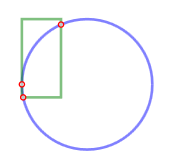

kld-intersections
=================

A library of intersection algorithms covering all SVG shape types.  
Possible to intersect rotated/scaled/skewed shapes. 

Test page can be found at [http://www.quazistax.com](http://www.quazistax.com).

Usage example
-------------

**Example 1:**


```javascript

    Intersection.intersectShapes(  
    		  IntersectionParams.newCircle(new Point2D(0,0), 50)  
    		, IntersectionParams.newRect(0, 0, 60, 30))  
    )

```

result points: ```[Point2D { x=50, y=0}, Point2D { x=40.00000000000001, y=30}]```

*x* of second point is not exactly 40 because of floating point imprecision / calculation error.

**Example 2:**



```javascript

    Intersection.intersectShapes(
    		  IntersectionParams.newCircle(new Point2D(0,0), 50)  
    		, IntersectionParams.newRect(0, 0, 60, 30)  
    		, Matrix2D.IDENTITY  
    		, Matrix2D.IDENTITY.translate(-20, -50).rotate(Math.PI/2)  
    )

```

result points: ```[Point2D { x=-20, y=-45.8257569495584}
, Point2D { x=-48.98979485566357, y=9.999999999999998}
, Point2D { x=-49.99999999999999, y=5.551115123125783e-15}]```

Install
-------
    npm install kld-intersections
